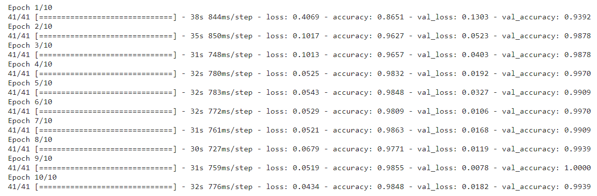

# Rock-Paper-Scissors
This project is a fun game that can be played with a bot which randomly shoots either rock or paper or scissors. Computer vision techniques are used to capture the hand gesture of the player via webcam which then is predicted by a trained machine learning model to be one of the mentioned three options.  
# Training Data  
For training the model for the project, the dataset that was used can be found here - https://www.kaggle.com/datasets/drgfreeman/rockpaperscissors.  
The dataset contains a total of 2188 RGB images (300 x 200) labeled as paper (712 images), rock (726 images) and scissors (750 images).    
The images were rotated 270 degrees prior to training using rotate.py 
# Summary of the work 
Methodology of the project in brief - 
•	Data augmentation (horizontal and vertical flip, width and height shift, shear) was performed to pre-process data 
•	20% data from the mentioned dataset was taken as validation data 
•	Transfer learning approach was used for training and a pretrained ResNet50 architecture was used as the base layer. The model was fine-tuned with the collected dataset      
•	Validation accuracy achieved was 99%  
•	OpenCV was used for taking in real-time hand gestures of the player  
•	The captured image was sent to the trained machine learning model to get the prediction  
# Performance 
  
   
 
# Let's Play! 
1. For model development and performance, check the provided ResNet50_rock_paper_scissors_v4_withlosscomparisongraph.ipynb file. 
2. Run the GUI_Rock_paper_scissor_final.py file with a functioning webcam plugged in. 
3. In the game window popped up, ‘Start’ button will start taking live feed and ‘Shoot’ button will make the bot play.  
4. To make sure the prediction from the live feed is as mentioned, noiseless/ monochrome background is a pre-requisite. 

